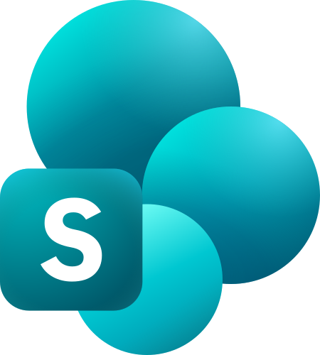
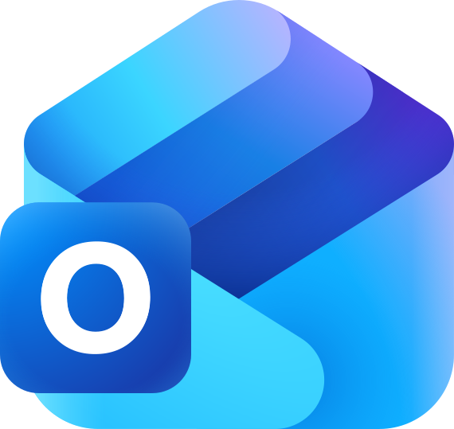
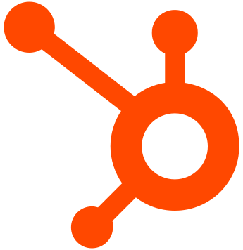
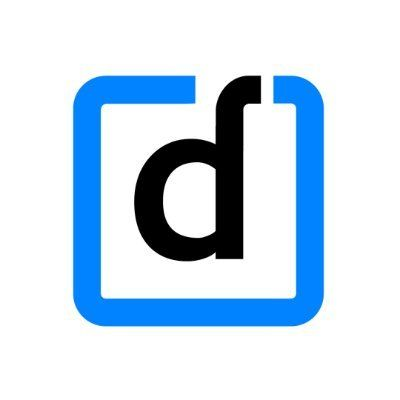

**The open-source AI agent for your company.**

Omni works across the tools your company already uses. It gathers relevant context, analyzes information, and carries out tasks while respecting existing permissions.

[Website](https://getomni.co)  •  [Documentation](https://docs.getomni.co)  •  [Deployment](#deployment)  •  [Features](#features)  •  [Architecture](#architecture)

---

## What is Omni?

Omni is an open-source, self-hosted AI agent for company-wide work.

It connects to tools like Google Drive, Gmail, Slack, Confluence, Jira, HubSpot, and internal file systems. Employees can ask Omni to investigate an issue, prepare an update, analyze company data, find information, or carry out supported actions across these systems from one conversation.

Omni brings the agent runtime, company context, tool access, model support, and source permissions into one system your team can deploy and operate.

## Features

- **Cross-Tool Task Execution**: Gather context and carry out supported actions across connected company systems.
- **Permission-Aware Company Context**: Keep indexed information scoped by the permissions inherited from each source system.
- **Grounded Answers with Citations**: Answer questions using company context and show the sources behind each response.
- **Hybrid Search and Retrieval**: Full-text BM25 search with ParadeDB and semantic search with pgvector, all inside Postgres.
- **Tool Use and Sandboxed Code Execution**: Run Python and bash in an isolated environment to inspect files, analyze data, and generate outputs.
- **Workplace Connectors**: Connect Google Workspace, Microsoft 365, Slack, Jira, Confluence, HubSpot, and other company systems.
- **Use the Models You Choose**: Anthropic, OpenAI, Gemini, AWS Bedrock, Vertex AI, Azure AI Foundry, or any OpenAI-compatible endpoint (vLLM, Ollama, LM Studio, LiteLLM, and others).
- **Self-Hosted by Design**: Run Omni entirely in your cloud, on-premises, or in an isolated environment.
- **Simple Deployment**: Use Docker Compose for single-server deployments or Terraform for production deployments on AWS and GCP.
- **Extensible with MCP and Connector SDKs**: Connect MCP tools or build company-specific integrations in Python or TypeScript.

## Architecture

Omni uses **Postgres ([ParadeDB](https://paradedb.com))** as the core data layer for BM25 full-text search, pgvector semantic search, and application data.

No Elasticsearch. No dedicated vector database. One database to tune, backup, monitor, and operate.

Core services are written in **Rust** for search, indexing, and connector orchestration; **Python** for the agent runtime and model orchestration; and **SvelteKit** for the web frontend. Each connector runs as its own lightweight container, allowing integrations to use different languages and dependencies without affecting the rest of the system.

The agent runtime can execute code in a sandboxed container on an isolated Docker network, with no access to internal services or the internet. It uses Landlock filesystem restrictions, resource limits, and a read-only root filesystem.

See the full [architecture documentation](https://docs.getomni.co/architecture) for more details.

## Deployment

Omni can be deployed entirely on your own infra. See our deployment guides:

- [Docker Compose](https://docs.getomni.co/deployment/docker-compose)
- [Omni CLI for Docker Compose upgrades and diagnostics](https://docs.getomni.co/deployment/cli)
- [Terraform (AWS/GCP)](https://docs.getomni.co/deployment/aws-terraform)

## Supported Integrations

### Google Workspace

<table border="0" cellpadding="20" cellspacing="0">
  <tr>
    <td align="center" width="150">&nbsp;  &nbsp;</td>
    <td align="center" width="150">&nbsp;  &nbsp;</td>
    <td align="center" width="150">&nbsp;  &nbsp;</td>
  </tr>
  <tr>
    <td align="center" width="150"><small><b>Google&nbsp;Drive</b></small></td>
    <td align="center" width="150"><small><b>Gmail</b></small></td>
    <td align="center" width="150"><small><b>Google&nbsp;Chat</b></small></td>
  </tr>
</table>

### Microsoft 365

<table border="0" cellpadding="20" cellspacing="0">
  <tr>
    <td align="center" width="150">&nbsp;  &nbsp;</td>
    <td align="center" width="150">&nbsp;  &nbsp;</td>
    <td align="center" width="150">&nbsp;  &nbsp;</td>
    <td align="center" width="150">&nbsp;  &nbsp;</td>
  </tr>
  <tr>
    <td align="center" width="150"><small><b>SharePoint</b></small></td>
    <td align="center" width="150"><small><b>OneDrive</b></small></td>
    <td align="center" width="150"><small><b>Outlook&nbsp;&amp;&nbsp;Calendar</b></small></td>
    <td align="center" width="150"><small><b>Teams</b></small></td>
  </tr>
</table>

### Knowledge Base & Documents

<table border="0" cellpadding="20" cellspacing="0">
  <tr>
    <td align="center" width="150">&nbsp;  &nbsp;</td>
    <td align="center" width="150">&nbsp;  &nbsp;</td>
    <td align="center" width="150">&nbsp;  &nbsp;</td>
    <td align="center" width="150">&nbsp;  &nbsp;</td>
    <td align="center" width="150">&nbsp;  &nbsp;</td>
    <td align="center" width="150">&nbsp;  &nbsp;</td>
  </tr>
  <tr>
    <td align="center" width="150"><small><b>Confluence</b></small></td>
    <td align="center" width="150"><small><b>Notion</b></small></td>
    <td align="center" width="150"><small><b>Nextcloud</b></small></td>
    <td align="center" width="150"><small><b>Paperless-ngx</b></small></td>
    <td align="center" width="150"><small><b>Web</b></small></td>
    <td align="center" width="150"><small><b>Local&nbsp;Files</b></small></td>
  </tr>
</table>

### Communication & Meetings

<table border="0" cellpadding="20" cellspacing="0">
  <tr>
    <td align="center" width="150">&nbsp;  &nbsp;</td>
    <td align="center" width="150">&nbsp;  &nbsp;</td>
    <td align="center" width="150">&nbsp;  &nbsp;</td>
  </tr>
  <tr>
    <td align="center" width="150"><small><b>Slack</b></small></td>
    <td align="center" width="150"><small><b>Fireflies</b></small></td>
    <td align="center" width="150"><small><b>IMAP</b></small></td>
  </tr>
</table>

### Project Management & Engineering

<table border="0" cellpadding="20" cellspacing="0">
  <tr>
    <td align="center" width="150">&nbsp;  &nbsp;</td>
    <td align="center" width="150">&nbsp;  &nbsp;</td>
    <td align="center" width="150">&nbsp;  &nbsp;</td>
    <td align="center" width="150">&nbsp;  &nbsp;</td>
  </tr>
  <tr>
    <td align="center" width="150"><small><b>Jira</b></small></td>
    <td align="center" width="150"><small><b>GitHub</b></small></td>
    <td align="center" width="150"><small><b>ClickUp</b></small></td>
    <td align="center" width="150"><small><b>Linear</b></small></td>
  </tr>
</table>

### Business Apps

<table border="0" cellpadding="20" cellspacing="0">
  <tr>
    <td align="center" width="150">&nbsp;  &nbsp;</td>
    <td align="center" width="150">&nbsp;  &nbsp;</td>
    <td align="center" width="150">&nbsp;  &nbsp;</td>
  </tr>
  <tr>
    <td align="center" width="150"><small><b>HubSpot</b></small></td>
    <td align="center" width="150"><small><b>Google&nbsp;Ads</b></small></td>
    <td align="center" width="150"><small><b>Darwinbox</b></small></td>
  </tr>
</table>

## Build a Connector

Use the [Connector SDK](https://docs.getomni.co/developers/sdk-overview) to build your own integrations with Omni.

See [CONTRIBUTING.md](CONTRIBUTING.md) for development setup and guidelines.

If you use [Claude Code](https://docs.anthropic.com/en/docs/claude-code), this repo includes a skill to help build connectors. Run `/build-connector <service name>` (e.g., `/build-connector Asana`).

## License

Apache License 2.0. See [LICENSE](LICENSE) for details.

---

[Documentation](https://docs.getomni.co) • [Discussions](https://github.com/getomnico/omni/discussions)

